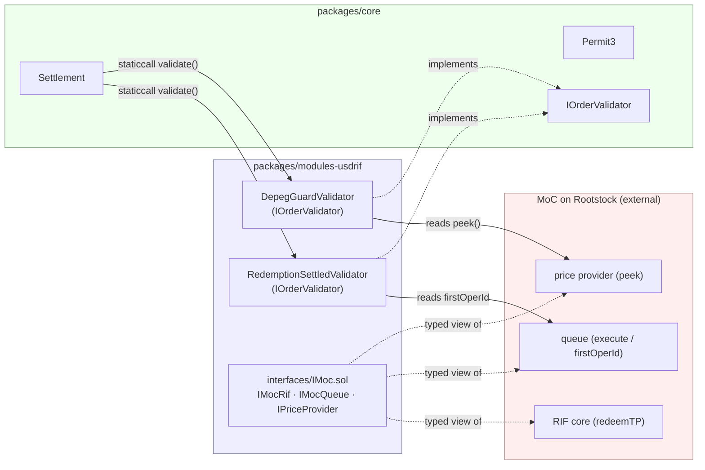

# USDRIF → USDT0 exit — how it works (diagrams)

Visual companion to [`README.md`](./README.md). Describes the **variant‑1** flow
that this package implements: the user redeems USDRIF→RIF natively on MoC, then a
solver fills a signed RIF→USDT0 limit order. The package's own contracts are the
two order validators (`RedemptionSettledValidator`, `DepegGuardValidator`).

---

## 1. The two phases at a glance

```
        PHASE 1 — initiate (async, MoC native redemption)        PHASE 2 — fill (atomic swap)
        ───────────────────────────────────────────────         ───────────────────────────────
  ┌──────┐  redeemTP (recipient = self)   ┌───────────┐
  │ USER │ ─────────────────────────────▶ │  MoC core │
  └──────┘  + signs RIF→USDT0 Order  └─────┬─────┘
     ▲                                          │ queues RedeemTP op
     │ RIF delivered                            ▼
     │ (~30–90s later)                    ┌───────────┐  execute()   ┌──────────────┐
     └─────────────────────────────────  │ MoC queue │ ◀─────────── │ MoC executor │
                                          └───────────┘   (guard)    └──────────────┘

                       ════════ time passes; RIF is now a settled on-chain fact ════════▶

                                                         ┌────────┐  fill(order,sig)  ┌────────────┐
                                                         │ SOLVER │ ────────────────▶ │ Settlement │
                                                         └────────┘                   └────────────┘
                                                              ▲   USDT0 ▶ user ; RIF ◀ user (Permit3)
```

Phase 1 is asynchronous (MoC queues, then an executor settles it). Phase 2 only
becomes possible **after** phase 1 settles — by then the RIF is present, fixed,
and on-chain, so the fill is a clean synchronous swap.

---

## 2. Sequence diagram

```mermaid
sequenceDiagram
    autonumber
    actor User as USDRIF seller (maker)
    participant Core as MoC RIF core
    participant Queue as MoC queue
    participant Exec as MoC executor (guard)
    actor Solver
    participant Settle as Settlement
    participant P3 as Permit3
    participant V as Validators

    rect rgb(235,245,255)
    note over User,Queue: PHASE 1 — initiate redemption (recipient == msg.sender)
    User->>Core: redeemTP(USDRIF, qTP, qACmin, recipient=User){value: getExecFee}
    Core->>Queue: queue RedeemTP op  → returns opId
    note right of User: User signs Order<br/>tokenIn=RIF, tokenOut=USDT0<br/>amountIn=qACmin, dutch decay<br/>validators=[settled(opId), depeg]
    end

    rect rgb(235,255,235)
    note over Queue,User: settlement (~30–90s)
    Exec->>Queue: execute(executor, batch, blocks)
    Queue->>User: deliver RIF (qAC ≥ qACmin)
    note over Queue: firstOperId advances past opId
    end

    rect rgb(255,245,235)
    note over Solver,P3: PHASE 2 — solver fills the order
    Solver->>Settle: fill(order, sig, amount)
    Settle->>V: staticcall validate(order, data)
    V-->>Settle: settled? (opId < firstOperId AND RIF ≥ minRif) ; price in band?
    Settle->>P3: transferFrom(solver → user, USDT0)
    Settle->>P3: transferFrom(user → solver, RIF)
    Settle-->>Solver: fillAmountOut (≥ endAmountOut floor)
    end
```

---

## 3. Token & authority flow during `fill`

```
                         Settlement.fill(order, sig, amountIn)
                                          │
            ┌─────────────────────────────┼──────────────────────────────┐
            │ 1. run validators (staticcall, AND-composed)                │
            │      RedemptionSettledValidator → opId<firstOperId & RIF≥min│
            │      DepegGuardValidator        → minPrice ≤ peek ≤ maxPrice │
            └─────────────────────────────┬──────────────────────────────┘
                                          │ (all true, else revert ValidationFailed)
            ┌─────────────────────────────┼──────────────────────────────┐
            │ 2. solver ──USDT0──▶ user    (Permit3, solver's allowance)   │
            │ 3. items: none (plain swap)                                  │
            │ 4. user ──RIF──▶ solver      (Permit3, maker's allowance)    │  ← reverts here
            └─────────────────────────────────────────────────────────────┘     if RIF not yet
                                                                                  delivered
   tokenIn  = RIF   (maker gives; pulled from the now-settled redemption)
   tokenOut = USDT0 (solver gives; ≥ endAmountOut floor, enforced by Settlement)
```

Two independent gates make a premature fill impossible:
- **Explicit:** `RedemptionSettledValidator` returns false until the op is
  dequeued *and* the user holds the RIF → clean `ValidationFailed` revert.
- **Implicit:** step 4's Permit3 RIF pull reverts if the maker has no RIF yet.

---

## 4. Components & dependency direction



`modules-usdrif` depends on `core`; `core` never depends on it. The MoC
contracts are external (Rootstock mainnet) — the package only holds typed
interfaces for them.

---

## 5. MoC operation lifecycle (the settlement signal)

```
 redeemTP(opId = N)         execute() processes ops in FIFO order
        │                            │
        ▼                            ▼
 ┌──────────────┐  block+≥1   ┌──────────────┐
 │   PENDING    │ ──────────▶ │   SETTLED    │
 │ N ≥ firstOper│             │ N < firstOper│   ← RedemptionSettledValidator passes
 │ RIF: 0       │             │ RIF: ≥ qACmin│      (combined with RIF balance ≥ minRif)
 └──────────────┘             └──────────────┘
```

- An op is executable once `block.number ≥ queuedBlk + minOperWaitingBlk (=1)`.
- `execute(...)` is restricted to the multi-collateral guard; the fork tests
  impersonate it. Ops execute strictly FIFO, so **`opId < firstOperId()`** is the
  cheap, reliable "settled" signal the validator uses.

---

## 6. Why the user (not a contract) calls `redeemTP`

```
   ✅ variant 1 (implemented)              ❌ pass-through module (not viable)
   ───────────────────────────            ──────────────────────────────────
   User ──redeemTP(recipient=User)──▶ MoC   Wrapper ──redeemTP(recipient=User)──▶ MoC
        recipient == msg.sender ✓                recipient != msg.sender ✗
        RIF lands at User                        reverts: RecipientMustBeSender()
```

MoC's `redeemTP` enforces `recipient == msg.sender` with no recipient‑flexible
variant, so a helper contract could only redeem **to itself** (the plan's
variant‑2 escrow + claim token, out of scope for the first cut). Hence variant 1:
the user redeems directly, and this package contributes the validators that make
the resulting order safe to auction.
